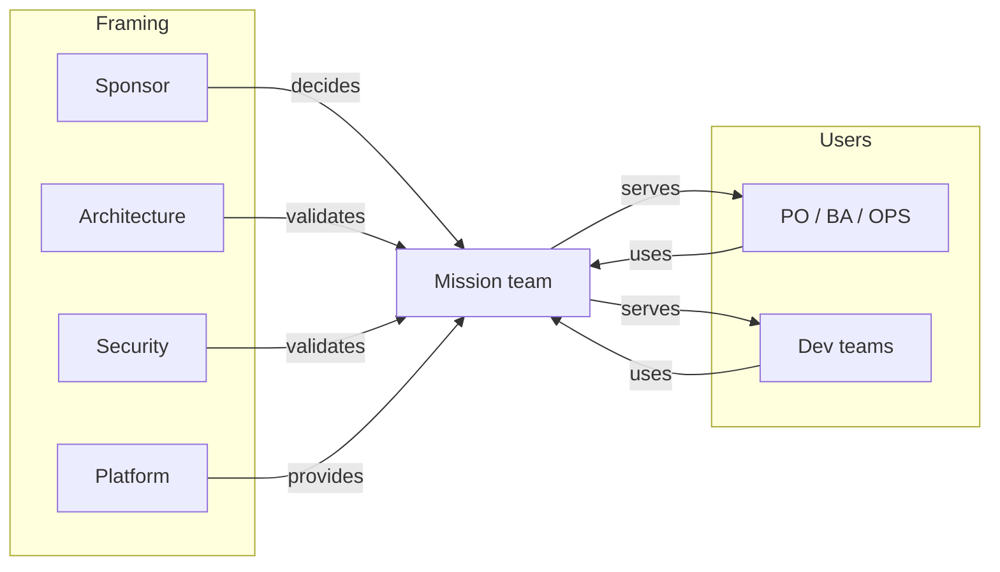

# Organization

## Teams and decision makers

## Rituals

## Actor map

Factual only. Judgments and tensions go in a `*.private.md`.
Actors marked `?` are to be confirmed.

```mermaid
flowchart LR
  subgraph Framing
    sponsor[Sponsor]
    archi[Architecture]
    secu[Security]
    platform[Platform]
  end
  mission[Mission team]
  subgraph Users
    pobaops[PO / BA / OPS]
    dev[Dev teams]
  end
  sponsor -->|decides| mission
  archi -->|validates| mission
  secu -->|validates| mission
  platform -->|provides| mission
  mission -->|serves| pobaops
  mission -->|serves| dev
  pobaops -->|uses| mission
  dev -->|uses| mission
```
